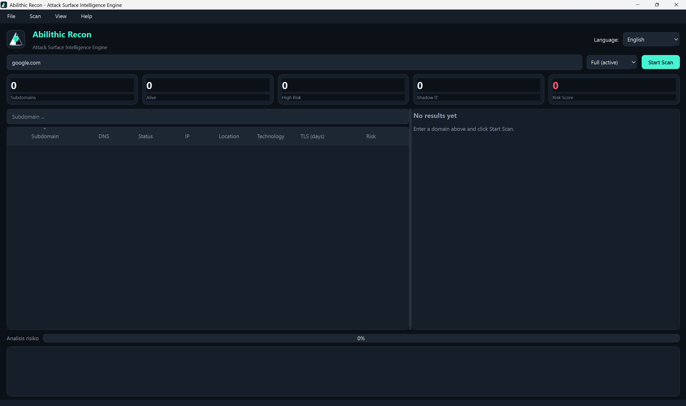
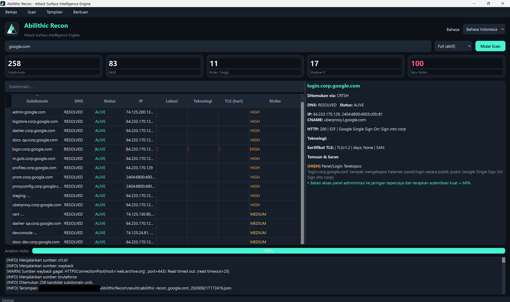
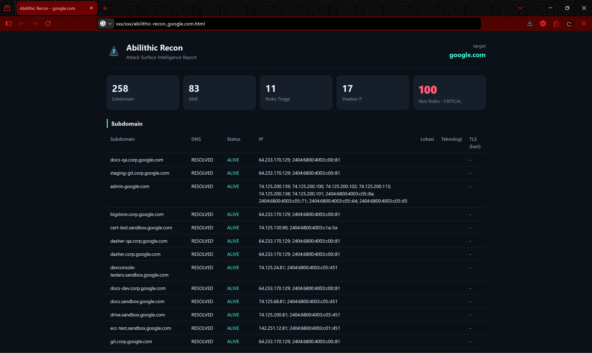
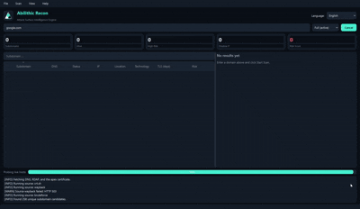

<div align="center">


# 🛡️ Abilithic Recon

### Attack Surface Intelligence Engine — *reveal everything exposed before attackers do.*


Discover a domain's subdomains, see which are alive, where they're hosted, what
they run, and which look like **Shadow IT** — then get fix recommendations.
**No API keys. No sign-ups.** One Windows app, click and run.

[](LICENSE)
[]()
[]()
[]()
[](../../releases)
[](https://www.linkedin.com/in/abil-khosim-itsec/)

[⬇️ Download](#-installation) · [✨ Features](#-key-features) · [📖 Usage](#-how-to-use) · [⚙️ How it works](#-how-it-works) · [⚠️ Disclaimer](DISCLAIMER.md)


</div>

---

## 🧩 The Problem

Organizations lose track of what they expose on the internet. Forgotten
`dev`, `staging`, and `old-api` subdomains, dangling DNS records, and exposed
admin panels — collectively **Shadow IT** — are exactly what attackers look for
first. Professional discovery tools usually need paid API keys and a steep
learning curve.

**Abilithic Recon** maps a domain's external attack surface using only **free,
public sources and an offline database** — wrapped in a clean desktop app that
anyone can run. Type a domain, get an actionable intelligence report.

## ✨ Key Features

- 🔍 **Subdomain discovery (no API key)** — Certificate Transparency (crt.sh),
  Wayback Machine, and DNS brute force.
- 🧪 **Wildcard-aware** — detects wildcard DNS and filters out false positives.
- ⚡ **Active host validation** — alive/dead with precise statuses (timeout, TLS
  error, refused), status code, server, and page title.
- 🌐 **Offline geolocation & ASN** — country/city/org per IP, no network call.
- 🧬 **Technology fingerprinting** — WordPress, Next.js, Laravel, Nginx, Cloudflare, and more.
- 🕵️ **Shadow IT, exposed-panel & subdomain-takeover detection** with fix recommendations.
- 📊 **Transparent risk score** — every point is explained.
- 🌍 **Bilingual** — full Indonesian / English UI and reports.
- 📁 **Reports** — self-contained HTML, JSON, and CSV; reopen saved scans.
- 🎨 **Modern GUI** — dark/light themes, sortable/filterable table, helpful hints on every menu.
- 💻 **Single `.exe`** — install nothing else.

## 🖼️ Screenshots

<div align="center">









</div>

## 💻 System Requirements

| | Minimum |
|---|---|
| OS | **Windows 10 or 11, 64-bit** (Qt 6 dropped Windows 7/8) |
| RAM | 2 GB |
| Disk | ~150 MB free |
| Network | Internet connection for online sources (the app itself needs no install) |

> Cross-platform note: the code also runs on Linux/macOS from source
> (`python main.py`), but official binaries are Windows-only for now.

## ⬇️ Installation

### For users (recommended)
1. Go to **[Releases](../../releases)**.
2. Download `AbilithicRecon.exe` (latest version).
3. Double-click to run — no installation needed.

> First launch on Windows may show SmartScreen ("Windows protected your PC")
> because the `.exe` is not yet code-signed. Click **More info → Run anyway**.
> You can verify integrity with the published `*.sha256.txt` checksum.

### For developers (run from source)
```bash
git clone https://github.com/abilithic/abilithic-recon.git
cd abilithic-recon
python -m venv .venv && .venv\Scripts\activate     # Windows
pip install -r requirements.txt
python main.py
```

### Build the .exe yourself
```bash
# Windows, one click:
build.bat
# or manually:
pip install -r requirements-dev.txt
pyinstaller abilithic-recon.spec --noconfirm
# -> dist\AbilithicRecon.exe
```

## 📖 How to Use

1. **Type a domain** (e.g. `example.com`) in the input box.
2. **Pick a mode:**
   - **Passive (safe)** — public sources only; never touches the target server.
   - **Full (active)** — adds DNS brute force + HTTP/HTTPS probing; asks you to
     confirm you're authorized.
3. Click **Start Scan**. Watch progress + live log; **Cancel** any time.
4. Browse the **subdomain table** (sort/filter), click a row for **details**.
5. Review **Shadow IT / findings** and **recommendations**.
6. **Export** an HTML report, JSON, or CSV. Saved scans can be reopened later.

### What each menu does (beginner hints)
Every menu item also shows a hint in the status bar when you hover it.

| Menu | What it does |
|---|---|
| **File ▸ New Scan** | Clear results and start a fresh domain. |
| **File ▸ Open Result** | Reopen a previously saved `.json` scan. |
| **File ▸ Save Result** | Save the full scan to reopen later. |
| **File ▸ Export** | HTML report (share/print), JSON (automation), CSV (Excel). |
| **Scan ▸ Start / Cancel** | Run or stop a scan. |
| **Scan ▸ Mode** | Switch between Passive (safe) and Full (active). |
| **View ▸ Theme** | Toggle dark/light. |
| **View ▸ Language** | Indonesian / English (also top-right). |
| **Help ▸ Docs / Disclaimer / Updates / About** | Guide, terms, latest version, credits. |

### Command line (optional)
```bash
python -m abilithic_recon.cli example.com --mode passive --lang en --format all
```

## ⚙️ How it Works

```
input domain
  → apex intel (DNS records, SPF/DMARC, RDAP, TLS)
  → wildcard guard
  → enumeration (crt.sh + Wayback + brute force[Full])
  → DNS resolve  → active probe[Full]
  → GeoIP/ASN (offline)  → fingerprint + TLS
  → Shadow IT / takeover / posture analysis
  → transparent risk score
  → report (HTML / JSON / CSV)
```

**Free, no-key data sources:** Certificate Transparency (crt.sh), Wayback Machine
CDX, live DNS, RDAP, direct TLS handshakes, and an **offline** GeoIP database
(DB-IP Lite / GeoLite2 — see [`abilithic_recon/data/geoip/README.md`](abilithic_recon/data/geoip/README.md)).

> Honest note: without paid intelligence APIs, subdomain coverage is smaller than
> tools like Amass + Shodan. In exchange, Abilithic Recon is offline-friendly,
> dependency-free for the user, and ideal as a trusted internal tool.

## 🗺️ Roadmap

- **v1.1** — Wayback link mining, HTML/JS crawling, AXFR, richer TLS analysis.
- **v1.2** — reverse DNS, PDF reports, expanded takeover signatures.
- **v2.0 (Abilithic Atlas)** — multi-domain view, scan history & diffing, scheduling.

## 🤝 Contributing

Issues and PRs welcome. Add a new subdomain source by subclassing `BaseSource`
and registering it in `sources/registry.py` — the engine needs no other change.

## ⚠️ Disclaimer

For **authorized security testing and educational use only**. Scan only domains
you own or are permitted to test. See [DISCLAIMER.md](DISCLAIMER.md).

## 📄 License

[MIT](LICENSE) © Abilithic. GeoIP data is provided under its respective license
(DB-IP: CC-BY / MaxMind: GeoLite2 EULA).

---

<!-- GitHub topics: cybersecurity, security-tools, infosec, osint, recon,
subdomain-enumeration, attack-surface, shadow-it, subdomain-takeover, dns,
certificate-transparency, pentesting, blue-team, windows, desktop-app, pyside6,
python, no-api -->
---

<div align="center">

### 👤 Developed by **Abil Khosim**
**Cybersecurity Specialist**

[](https://www.linkedin.com/in/abil-khosim-itsec/)

*Abilithic Recon* is an original project by Abil Khosim.
Released under the [MIT License](LICENSE) — © 2026 Abil Khosim. Please keep this
attribution when reusing or redistributing.

<sub>Security, built like stone. 🛡️</sub>

</div>
